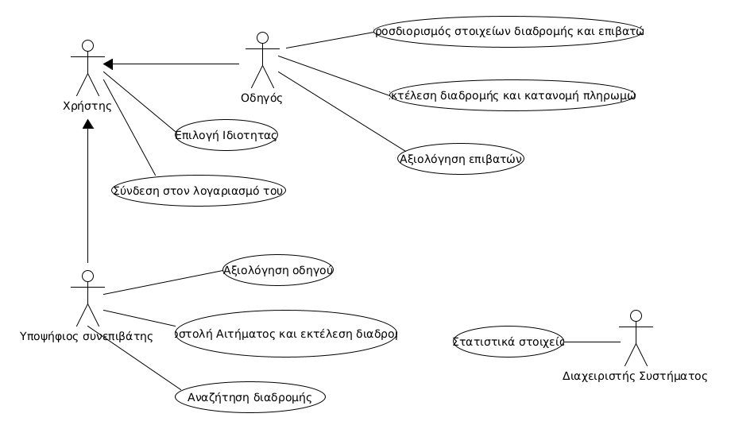
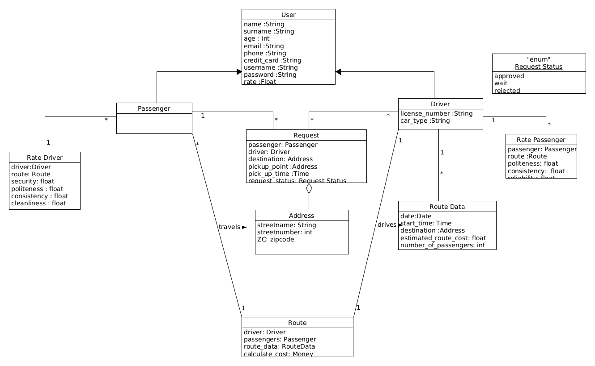

# R.2  Απαιτήσεις λογισμικού / Ανάλυση συστήματος

## Διάγραμμα περιπτώσεων χρήσης

## Περιγραφή περιπτώσεων χρήσης

### [ΠΧ1 Σύνδεση στο λογαριασμό](uc1-login.md)

### [ΠΧ2 Επιλογή Ιδιότητας](uc2-user-attribute.md)

### [ΠΧ3 Αναζήτηση διαδρομής](uc3-route-search.md)

### [ΠΧ4 Αποστολή αιτήματος και εκτέλεση διαδρομής](uc4-send-request.md)

### [ΠΧ5 Αξιολόγηση οδηγού](uc5-rate-driver.md)

### [ΠΧ6 Προσδιορισμός στοιχείων διαδρομής και επιλογή επιβατών](uc6-route-and-passenger-details.md)

### [ΠΧ7 Εκτέλεση διαδρομής και κατανομή πληρωμών](uc7-route-excecution-and-payment-distribution.md)

### [ΠΧ8 Αξιολόγηση συνεπιβατών](uc8-rate-passenger.md)

### [ΠΧ9 Στατιστικά στοιχεία](uc9-statistics.md)

## Συμπληρωματικές προδιαγραφές

### Απαιτήσεις διεπαφών

#### Διεπαφές χρήστη

- Οι χρήστες (συνεπιβάτες, οδηγός) αλληλεπιδρούν με την εφαρμογή μέσω ενός graphical user interface (GUI).
- Όλες οι διεπαφές χρήστη θα είναι διαδικτυακές.

#### Διεπαφές υλικού

- Το σύστημα χρησιμοποιεί δικτυακή υποδομή που επιτρέπει την μετάδοση δεδομένων μεταξύ των χρηστών.
- Χρησιμοποιείται το gps για την εύρεση του οδηγού και του συνεπιβάτη.  
- Σύστημα διαχείρισης πληρωμών.

#### Διεπαφές επικοινωνίας

- Το σύστημα θα στέλνει μυνήματα σχετικά με το κόστος της διαδρομής.
- Το σύστημα θα στέλνει μυνήματα σχετικά με την αλλαγή της κατάστασης του αιτήματος.
- Το σύστημα θα στέλνει μυνήματα σχετικά με την προσθήκη νέας αξιολόγησης.

#### Διεπαφές λογισμικού

- Σύστημα ειδοποιήσεων που θα ενημερώνει για τις διεπαφές επικοινωνίας.
- Η εφαρμογή θα χρησιμοποιείται από το λειτουργικό σύστημα των Android.

### Περιορισμοί σχεδίασης και υλοποίησης

Το σύστημα θα αναπτυχθεί σε Java και για την αποθήκευση δεδομένων θα χρησιμοποιηθεί η μνήμη της συσκευής.

### Ποιοτικά χαρακτηριστικά

#### Απόδοση

- Η εφαρμογή να χαρακτηρίζεται από αποδοτικότητα στον τρόπο που πραγματοποιεί τις λειτουργίες της.
- Η εφαρμογή θα πρέπει να ανταποκρίνεται άμεσα στις ενέργειες του χρήστη.

#### Διαθεσιμότητα

- Το σύστημα θα είναι διαθέσιμο όλες τις ημέρες και ώρες.
- Η εφαρμογή θα είναι διαθέσιμη σε όλες τις συσκευές που υποστιρίζουν το λογισμικό Android.

#### Ασφάλεια

- Η εφαρμογή να διασφαλίζει την ασφάλεια των δεδομένων των χρηστών της απο εξωγενείς και κακόβουλους παράγοντες.
- Ο χρήστης θα ταυτοποιείται κάθε φορά που εισέρχεται στην εφαρμογή μέσω ενός username και password.
- Τα στοιχεία της κάρτας θα κρυπτογραφούνται.

#### Ευελιξία

- Η εφαρμογή να είναι ευέλικτη, δηλαδή να μπορεί να χρησιμοποιηθεί οπουδήποτε, οποιαδήποτε χρονική στιγμή.

#### Ευχρηστία

- Η μόνη προϋπόθεση για τον τελικό χρήστη είναι να γνωρίζει να εγκαθιστά και να χρησιμοποιεί Android εφαρμογή.

## Μοντέλο πεδίου

