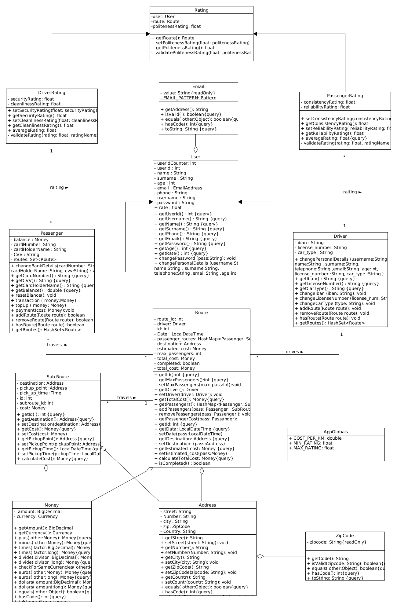
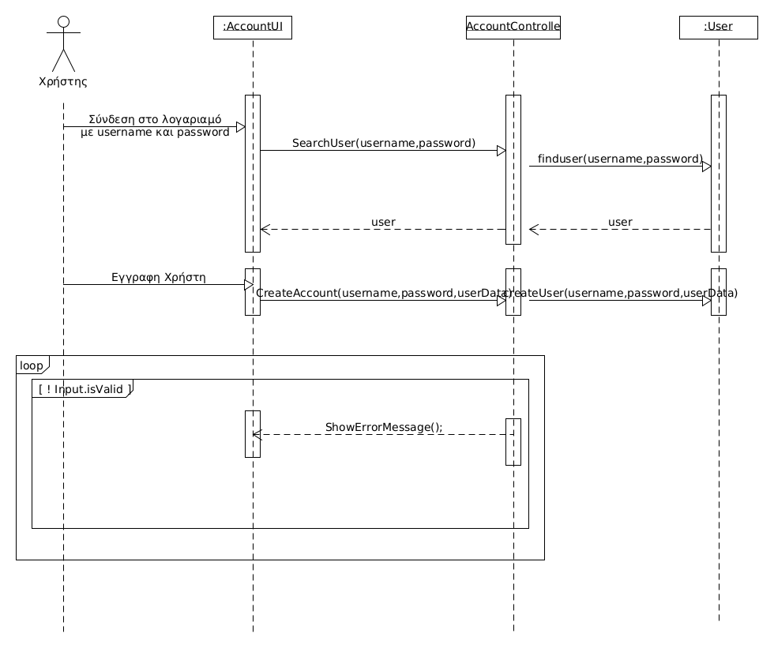
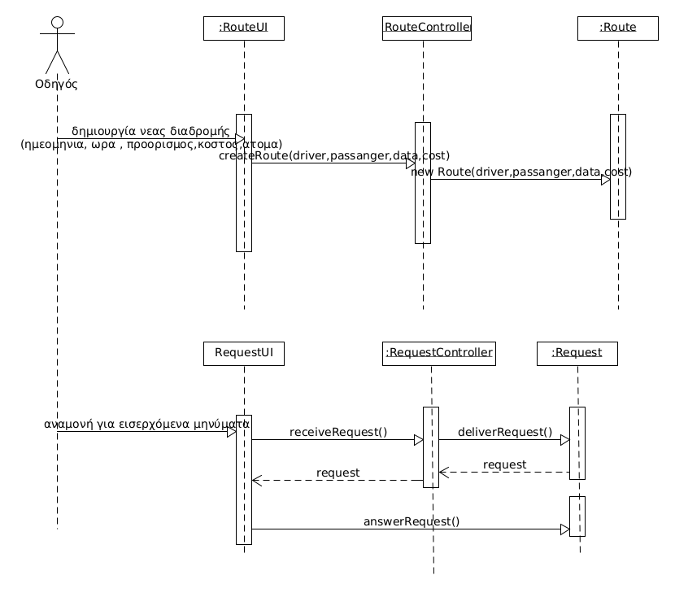
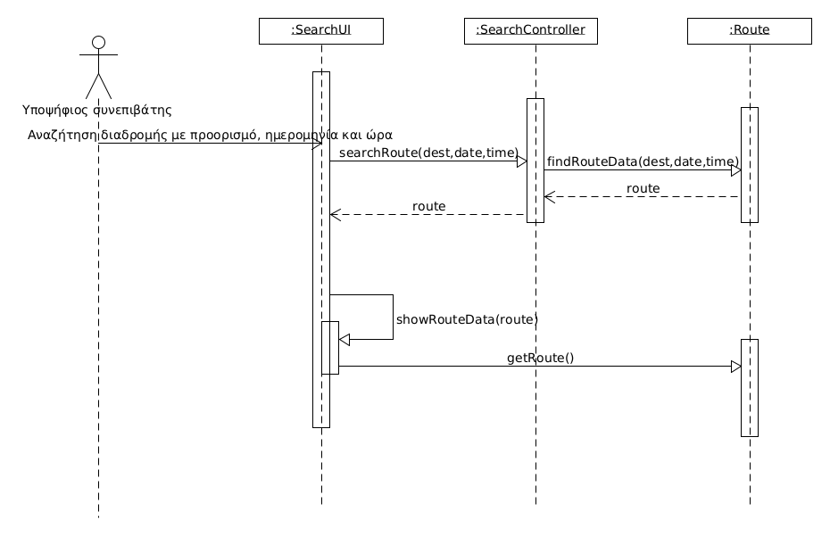
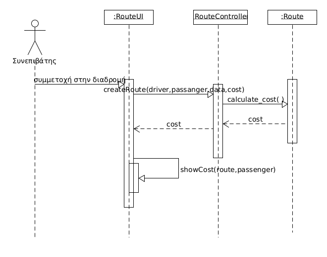
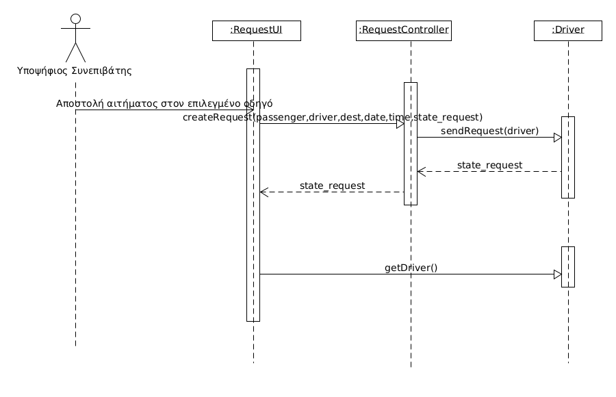
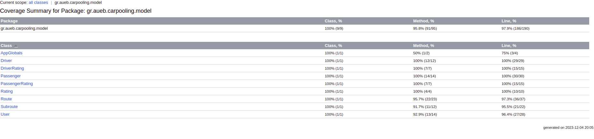
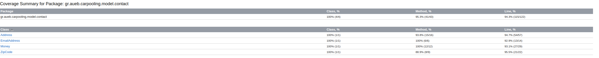
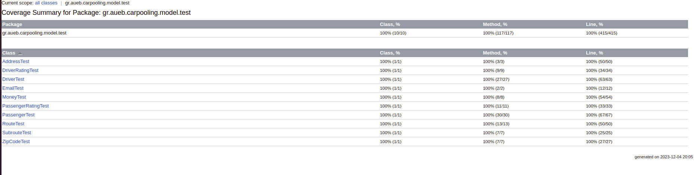

# R.3  Σχεδίαση και υλοποίηση της λογικής του πεδίου

## 3.1 Διάγραμμα κλάσεων για την περιγραφή της στατικής οψης του πεδίου του προλήματος

## 3.1  Διαγράμματα ακολουθίας

## Σύνδεση στον λογαριασμό

## Προσδιορισμός στοιχείων διαδρομής και επιλογή επιβατών

## Αναζήτηση διαδρομής

## Αποστολή αιτήματος και εκτέλεση διαδρομής

## 3.2 Υλοποίηση της λογικής του πεδίου σε Java

[Βρίσκονται εδώ](/app/src/main/java/gr/aueb/carpooling/model)

## 3.3 Αυτόματοι έλεγχοι σε JUnit οι οποίοι ελέγχουν τη λογική του πεδίου

[Βρίσκονται εδώ](/app/src/main/java/gr/aueb/carpooling/model/test)

## 3.4 Αναφορές καλύψεων του κώδικα

