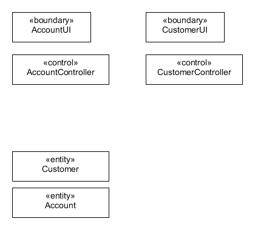
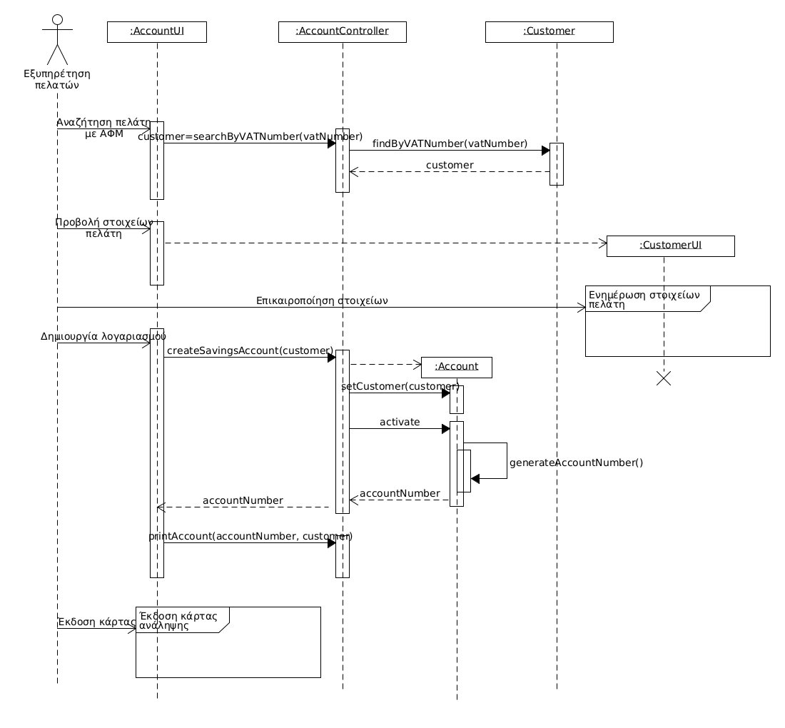
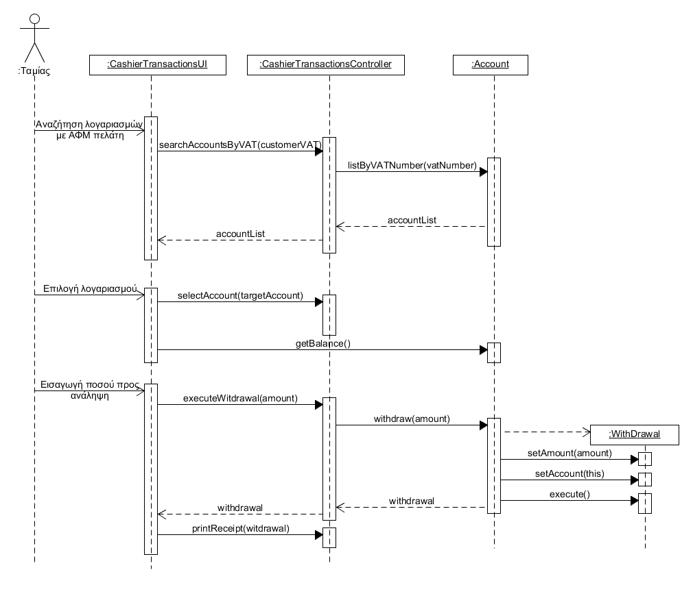

# Εισαγωγή

Το θέμα της εφαρμογής με την οποία θα ασχολήθουμε είναι το car pooling.

# Συνολική περιγραφή

Η εφαρμογή αυτή, θα επιτρέπει στους χρήστες που μετακινούνται με το αυτοκίνητό τους να μοιραστούν τα έξοδα της διαδρομής με άλλους χρήστες που θέλουν να μετακινηθούν προς τον ίδιο προορισμό με σκοπό να μοιραστεί τα έξοδα χρήσης του οχήματος που προκύπτουν, όπως βενζίνη, parking, service, ανταλλακτικά και διόδια.
Ο κάθε χρήστης θα πρέπει να κάνει εγγραφή στην εφαρμογή συμπληρώνοντας προσωπικά του στοιχεία, όπως ονοματεπώνυμο, ηλικία, email,τηλέφωνο, πιστωτική κάρτα και αν έχει την δυνατότητα να είναι οδηγός τότε θα συμπληρώνει τον αριθμό άδειας οδήγησης και τύπο αυτοκινήτου του. Ακόμα θα δημιουργεί ένα username και ένα password ώστε να γίνεται η ταυτοποιησή του κάθε φορά που μπαίνει στην εφαρμογή.

Κάθε φορά κατά την εισαγωγή στην εφαρμογή ο χρήστης θα επιλέγει την ιδιότητα του, δηλαδή οδηγός ή υποψήφιος συνεπιβάτης.

- Αν είναι οδηγός: θα πρέπει να δηλώσει ημερομηνία, ώρα εκκίνησης, προορισμό, εκτιμώμενο κόστος διαδρομής (κόστος ανά χιλιόμετρο) και αριθμό συνεπιβατών που μπορεί να μεταφέρει.
- Αν είναι υποψήφιος συνεπιβάτης: θα πρέπει να κάνει αναζήτηση μέσω του συστήματος σχετικά με τον προορισμό, την ημέρα και ώρα εκκίνησης. Η εφαρμογή θα του εμφανίζει τους οδηγούς που θα εκτελέσουν αυτή τη διαδρομή όσο πιο κοντά στην επιθυμητή ώρα εκκίνησης και θα επιλέγει τον οδηγό που ταιριάζει καλύτερα στο πρόγραμμα του αλλά και με την βαθμολογία του οδηγού.

Στην συνέχεια, ο οδηγός εγκρίνει τα διάφορα αιτήματα ανάλογα με την βαθμολογία του υποψήφιου συνεπιβάτη και αν το σημείο παραλαβής του βρίσκεται εντός της διαδρομής του. Στους υποψήφιους επιβάτες η εφαρμογη θα εμφανίζει την κατάσταση του αιτήματος (απορρίφθηκε,σε αναμονή και εγκρίθηκε). Στους επίλεγμενους επιβάτες θα δίνονται και τα αναλυτικά στοιχεία του οδηγού.

Μετά την ολοκλήρωση της διαδρομής, κάθε συνεπιβάτης πληρώνει το ποσοστό του κόστους που του αναλογεί,σύμφωνα με τα χιλιόμετρα που διένυσε. Το ποσοστό αυτό κατανέμεται μεταξύ του οδηγού και της εταιρείας που διαχειρίζεται το σύστημα carpooling (5% για την εφαρμογή). Ο οδηγός μπορεί να αξιολογήσει τους υποψήφιους συνεπιβάτες (ευγένεια, συνέπεια, αξιοπιστία) και αντίστοιχα εκείνοι τον οδηγό (ασφάλεια, ευγένεια, συνέπεια, καθαριότητα).

Το σύστημα θα παράγει στατιστικά στοιχεία όπως μηνιαία έσοδα της εταιρείας που προσφέρει την εφαρμογή, αριθμός διαδρομών, μέση πληρότητα των αυτοκινήτων που συμμετέχουν στο σύστημα κτλ.

## Επισκόπηση μοντέλου περιπτώσεων χρήσης

\[*Εισάγουμε το διάγραμμα περιπτώσεων χρήσης. Βλέπε σχήμα 3-19 του παραδείγματος 3-11 στη σελίδα 168 του βιβλίου.*

*Εισάγουμε έναν πίνακα με τους κωδικούς, τους τίτλους και μία σύντομη περιγραφή των περιπτώσεων χρήσης. Βλέπε πίνακα 3-8 του παραδείγματος 3-11 στη σελίδα 168 του βιβλίου*\]

## Υποθέσεις και εξαρτήσεις

\[*Γράφουμε τις υποθέσεις που κάνουμε και τις εξαρτήσεις του συστήματος σε σχέση με το περιβάλλον του.*\]

# Ειδικές Απαιτήσεις 

## Περιπτώσεις χρήσης

### Οι ενδιαφερόμενοι και οι ανάγκες τους

\[*Ένας πίνακας των ενδιαφερομένων (stakeholders) με τις ανάγκες τους. Βλέπε πίνακα 3-6 του παραδείγματος 3-2 στη σελίδα 138 του βιβλίου.*\]

### Actors του συστήματος

\[*Ένα πίνακας με του actors του συστήματος. Βλέπε πίνακας 3-7 παραδείγματος 3-11 στη σελίδα 167 του βιβλίου.*\]

### Περιγραφές περιπτώσεων χρήσης

\[*Γράφονται οι περιπτώσεις χρήσης οι οποίες συνοδεύονται με διαγράμματα δραστηριότητας εάν θεωρηθεί αναγκαίο.*

*Βλέπε , το παράδειγμα 3-7 στη σελίδα 159, το παράδειγμα 3-8 στη σελίδα 160 και το παράδειγμα 3-9 στη σελίδα 162.*\]

#### [ΠΧ1 Συναλλαγή από ταμείο](uc1-cashier-transactions.md)

#### [ΠΧ2 Διαχείριση Λογαριασμού](uc2-account-management.md)

#### [ΠΧ3 Διαχείριση Στοιχείων Πελάτη](uc3-client-management.md)

#### [ΠΧ4 Έκδοση κάρτας ανάληψης](uc4-debit-card-management.md)

#### ΠΧ5 Ανατοκισμός

#### ΠΧ6 Συναλλαγή από ΑΤΜ

#### ΠΧ7 Ταυτοποίηση Χρήστη

## Συμπληρωματικές προδιαγραφές

\[*Οι επόμενες ενότητες περιέχουν όλες τις μη λειτουργικές απαιτήσεις και τους περιορισμούς σχεδίασης και υλοποίησης.*\]

### Απαιτήσεις διεπαφών

#### Διεπαφές χρήστη

\[*Βλέπε πίνακα 5-2 του παραδείγματος 5-1 στη σελίδα 305*\]

#### Διεπαφές υλικού

\[*Βλέπε πίνακα 5-2 του παραδείγματος 5-1 στη σελίδα 305*\]

#### Διεπαφές επικοινωνίας

\[*Βλέπε πίνακα 5-2 του παραδείγματος 5-1 στη σελίδα 305*\]

#### Διεπαφές λογισμικού

\[*Βλέπε πίνακα 5-2 του παραδείγματος 5-1 στη σελίδα 305*\]

### Περιορισμοί σχεδίασης και υλοποίησης

\[*Βλέπε πίνακα 5-3 του παραδείγματος 5-1 στη σελίδα 305*\]

### Ποιοτικά χαρακτηριστικά

#### Απόδοση

\[*Βλέπε πίνακα 5-4 του παραδείγματος 5-1 στη σελίδα 306*\]

#### Διαθεσιμότητα

\[*Βλέπε πίνακα 5-4 του παραδείγματος 5-1 στη σελίδα 306*\]

#### Ασφάλεια

\[*Βλέπε πίνακα 5-4 του παραδείγματος 5-1 στη σελίδα 306*\]

#### Ευελιξία

\[*Βλέπε πίνακα 5-4 του παραδείγματος 5-1 στη σελίδα 306*\]

#### Ευχρηστία

\[*Βλέπε πίνακα 5-4 του παραδείγματος 5-1 στη σελίδα 306*\]

# Υποστηρικτικό υλικό

## Μοντέλο πεδίου

\[*Εισάγουμε το μοντέλο πεδίου του συστήματος. Βλέπε σχήμα 4-100 του παραδείγματος 4-13 στη σελίδα 251 του βιβλίου*\]

## Ανάλυση περιπτώσεων χρήσης
--------------------------

### Κλάσεις ανάλυσης

\[*Εισάγουμε ένα διάγραμμα κλάσεων με την αρχική έκδοση των κλάσεων λογισμικού. Βλέπε σχήμα 4-104 του παραδείγματος 4-14 στη σελίδα 258 του βιβλίου*\]

Κλάσεις ανάλυσης που έχουν προκύψει από την ανάλυση των περιπτώσεων χρήσης *Διαχείριση Λογαριασμού* και *Διαχείριση Στοιχείων Πελάτη*.

### Συμπεριφορές

\[*Για κάθε σημαντική περίπτωση χρήσης εισάγουμε ένα διάγραμμα κλάσεων με τις κλάσεις που συμμετέχουν στη συμπεριφορά του συστήματος για την περίπτωση χρήσης. Το σημαντικότερο όμως είναι ένα διάγραμμα επικοινωνίας ή ακολουθίας που δείχνει την ανταλλαγή μηνυμάτων.*

*Βλέπε το παράδειγμα 4-16 στη σελίδα 262 του βιβλίου*\]

#### Άνοιγμα νέου λογαριασμού

#### Ανάληψη μετρητών από ταμείο

## Άλλα μοντέλα
------------

\[*Άλλα μοντέλα όπως για παράδειγμα διαγράμματα μηχανής καταστάσεων, πίνακες απόφασης κλπ. Βλέπε παράδειγμα 4-6 του βιβλίου*\]

## Επιχειρησιακοί κανόνες

\[*Ένας πίνακας με του επιχειρησιακούς κανόνες. Βλέπε πίνακα 3-4 του παραδείγματος 3-1 στη σελίδας 133 του βιβλίου.*\]

| Επιχειρησιακοί κανόνες | Περιγραφή |
| :----------------------| :---------|
| ΕΚ1 | O Αριθμός Δελτίου Ταυτότητας και το ΑΦΜ είναι μοναδικά για κάθε πελάτη 
| ΕΚ2 | Όλα τα στοιχεία του πελάτη είναι υποχρεωτικά, με εξαίρεση τον αριθμό Fax
| ΕΚ3 | Η ηλικία του πελάτη θα πρέπει να είναι μεγαλύτερη των 18 ετών
