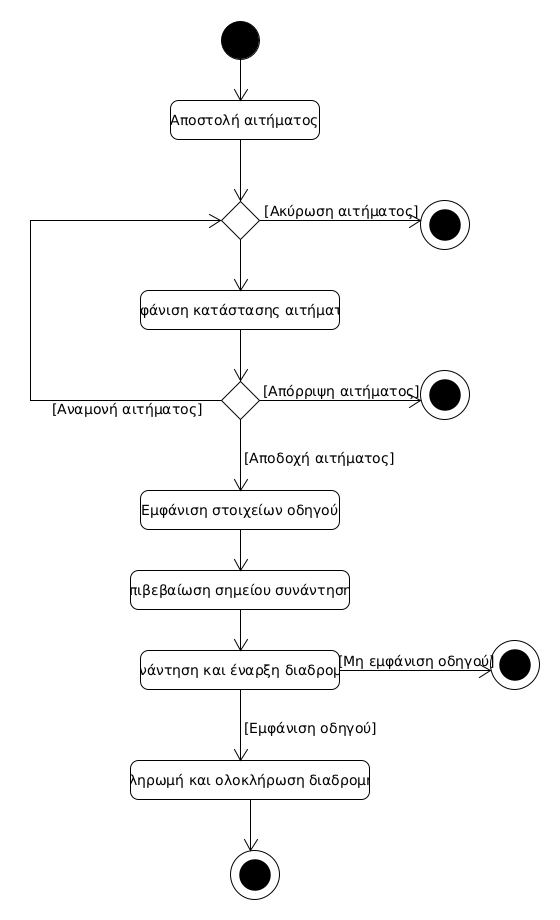
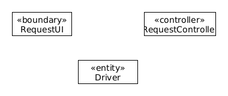

# ΠΧ4. Αποστολή αιτήματος και εκτέλεση διαδρομής

**Πρωτεύων Actor**: Υποψήφιος συνεπιβάτης

**Ενδιαφερόμενοι**:

**Υποψήφιος συνεπιβάτης**: Θέλει επιλέξει την καταλληλότερη διαδρομή για αυτόν, καθώς και τον αντίστοιχο οδηγό και να εκτελέσει την διαδρομή του.

**Οδηγός**: Θέλει να αποδέχεται όσα περισσότερα αιτήματα μπορεί, με βάση τα κριτήρια επιλογής του.

**Προϋποθέσεις**: Ο υποψήφιος συνεπιβάτης θα έχει εκτελέσει με επιτυχία την περίπτωση χρήσης "Αναζήτηση διαδρομής".

## Βασική Ροή

1. Ο υποψήφιος συνεπιβάτης επιλέγει την διαδρομή και τον οδηγό που επιθυμεί και στέλνει αίτημα σε αυτόν.
2. Η εφαρμογή εμφανίζει την κατάσταση του αιτήματος.
3. Η εφαρμογή εμφανίζει στον επιλεγμένο συνεπιβάτη τα αναλυτικά στοιχεία του οδηγού, καθώς και το ποσό που θα πληρώσει.
4. Ο υποψήφιος συνεπιβάτης επιβεβαιώνει το σημείο συνάντησης.
5. Ο υποψήφιος συνεπιβάτης συναντά τον οδηγό και η διαδρομή ξεκινά.
6. Ο υποψήφιος συνεπιβάτης πληρώνει το απαιτούμενο ποσό και η διαδρομή ολοκληρώνεται.

## Εναλλακτικές Ροές

*1α. Ο υποψήφιος συνεπιβάτης ακυρώνει το αίτημα*
    1. Η περίπτωση χρήσης τερματίζει.

*3α. Μη επιλεγμένος συνεπιβάτης*
    1. Αν ο οδηγός δεν αποδεχτεί το αίτημα, η περίπτωση χρήσης τερματίζει.

*5α. Ο οδηγός δεν εμφανίζεται*
    1. Αν ο οδηγός δεν εμφανιστεί στο σημείο συνάντησης, η περίπτωση χρήσης τερματίζεται.

## Διαγράμμα δραστηριότητας

## Κλάσεις ανάλυσης

## Διάγραμμα ακολουθίας

